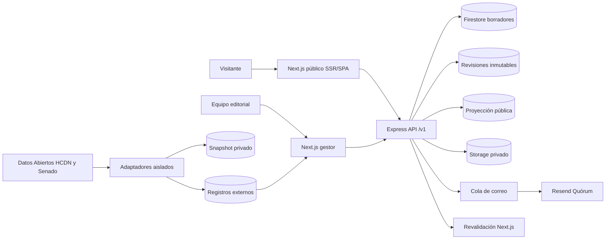

# Arquitectura de Quórum

Los contratos Zod son el límite común de frontend y backend. Cada proyecto referencia una versión concreta de workflow; una versión nueva desactiva la anterior pero no modifica publicaciones existentes. Veto y archivo son etapas terminales con `branchFromId`, fuera de la progresión lineal principal.

La publicación valida relaciones activas, crea un snapshot inmutable, actualiza borrador y proyección pública dentro de una transacción, registra auditoría y opcionalmente encola correo. Una restauración copia un snapshot a un borrador: nunca reescribe el historial ni notifica automáticamente.

El gestor usa Google Identity, cookie `Secure`/`HttpOnly`, origen exacto y token CSRF. `quorum_admin` incluye las capacidades de `quorum_editor`; sólo administración modifica usuarios, catálogos, configuración y restauraciones.

Las fuentes legislativas externas no escriben proyecciones públicas. Cada descarga pasa por un adaptador versionado, validación estructural, umbral de plausibilidad y archivo del original. Un snapshot inválido queda en cuarentena y el último conjunto válido continúa vigente. Un job OIDC diario comprueba la fecha de vencimiento de cada fuente y respeta el intervalo de 90 días. Las diferencias quedan en una bandeja editorial; aplicar campos es explícito, transaccional, crea revisión y procedencia, y exige confirmación administrativa si la ficha es pública.

Los términos contextuales viajan dentro de la proyección de cada proyecto. Next.js divide el texto en nodos seguros y deterministas sin inyectar HTML. La interacción de tooltip u hoja móvil es completamente local: no consulta la API y siempre enlaza a la ficha canónica del glosario.
